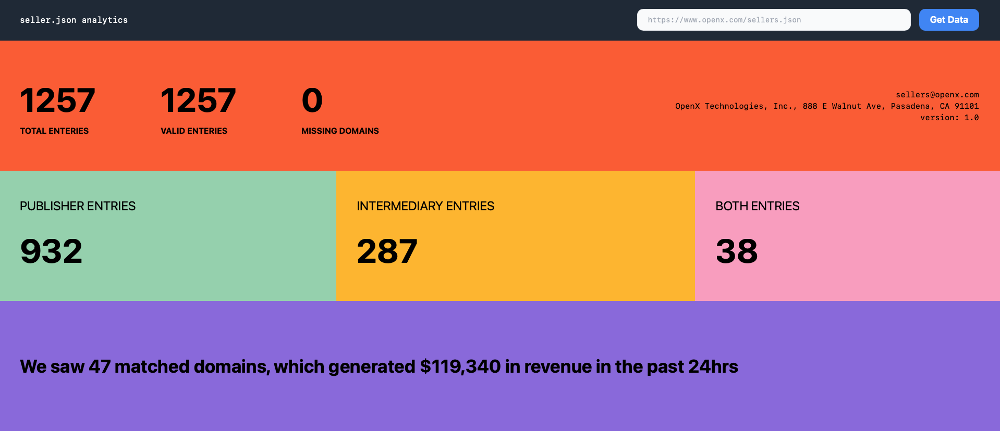

# Sellers.json parser



This application is used to parse through a [sellers.json](https://iabtechlab.com/wp-content/uploads/2019/07/Sellers.json_Final.pdf) file. This enables you to check how many enteries there are, which ones have a valid `"domain":` field and which ones do not.

This also lists how many of those valid domain enteies have `seller_type` as `"PUBLISHER"`, `"INTERMEDIARY"` and `"BOTH"`. 

### Installing

Clone the repo:

```zsh
https://github.com/mrpbennett/sellersjson_py.git
```
The application uses [pipenv](https://pipenv.pypa.io/en/latest/), so once you have cloned the repo. You're able to just run the following from the root dir.

```
pipenv install
```
This will install the applications dependencies. 

### Running the application

After installing the dependencies, simply run to activate the shell:

```
pipenv shell
```

The simple run:

```
pipenv run python app.py
```
To start the application

---
TODO:

- [ ] connect to presto and pull simple domain query to get domains and revenue
- [ ] export sellers: domains to a .csv
- [ ] compare presto domains agiasnt sellers domain and output matched domains with their MTD revenue
  
